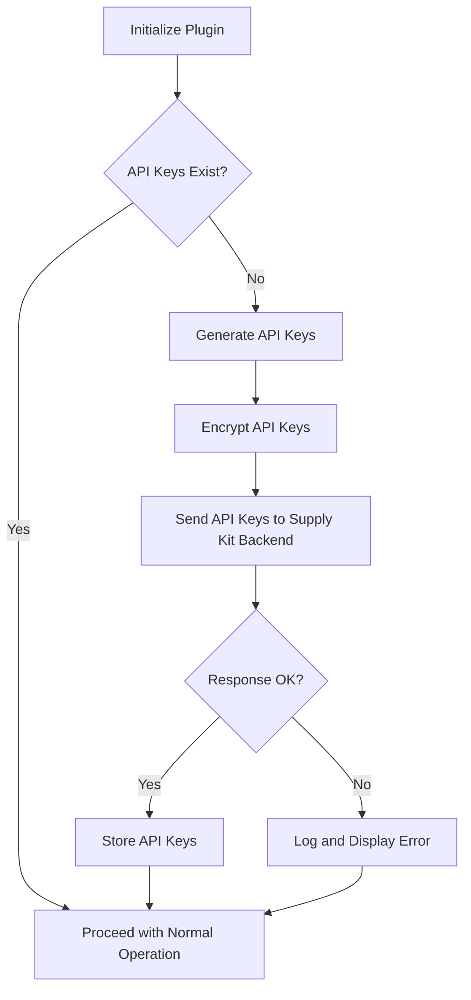

# Supply Kit WooCommerce Integration

**Plugin Name:** Supply Kit WooCommerce Integration  
**Plugin URI:** https://supplykit.com  
**Description:** Integrates WooCommerce with Supply Kit to sync products, customers, and orders.  
**Version:** 1.0  
**Author:** Supply Kit Team  
**Author URI:** https://supplykit.com  

## Description

The Supply Kit WooCommerce Integration plugin connects your WooCommerce store with Supply Kit, enabling seamless synchronization of products, customers, and orders. This plugin ensures that your store data is always up-to-date with Supply Kit.

## Installation

1. Upload the plugin files to the `/wp-content/plugins/supply-kit-integration` directory, or install the plugin through the WordPress plugins screen directly.
2. Activate the plugin through the 'Plugins' screen in WordPress.
3. Navigate to the 'Supply Kit' settings page in the WordPress admin menu to configure the plugin.

## Usage

Once the plugin is activated, it will automatically generate and send API keys to the Supply Kit backend if they do not already exist. The plugin also provides a settings page in the WordPress admin menu where you can manage the integration.

## Hooks

- `admin_menu`: Adds the settings page to the WordPress admin menu.
- `admin_post_generate_keys`: Handles form submission to generate and send API keys.
- `admin_enqueue_scripts`: Adds custom admin styles.
- `admin_notices`: Displays an admin notice if API keys are missing.

## Functions

### `__construct()`

- Initializes the plugin, adds hooks, and generates API keys if they do not exist.

### `add_settings_page()`

- Adds the settings page to the WordPress admin menu.

### `api_keys_exist()`

- Checks if API keys exist in WooCommerce.

### `verify_site_url($site_url)`

- Sends the site URL to Supply Kit for verification.

### `check_existing_keys($consumer_key)`

- Compares API keys from Supply Kit in WooCommerce.

### `log_and_display_error($message)`

- Displays and stores errors.

### `check_and_display_admin_notice()`

- Displays an admin notice if API keys are missing.

### `settings_page_html()`

- Outputs the HTML content for the settings page.

### `generate_and_send_keys()`

- Generates and sends API keys to the Supply Kit backend.

### `encrypt_key($key, $token)`

- Encrypts the API key.

### `decrypt_key($encrypted_key, $token)`

- Decrypts the API key.

### `add_error($message)`

- Adds an error message to the error array.

### `display_errors()`

- Displays error messages.

### `enqueue_admin_styles()`

- Enqueues custom CSS styles for the admin panel.

## Logical Flow Diagram

## Changelog

### 1.0
- Initial release.

## License

This plugin is licensed under the GPLv2 or later.

